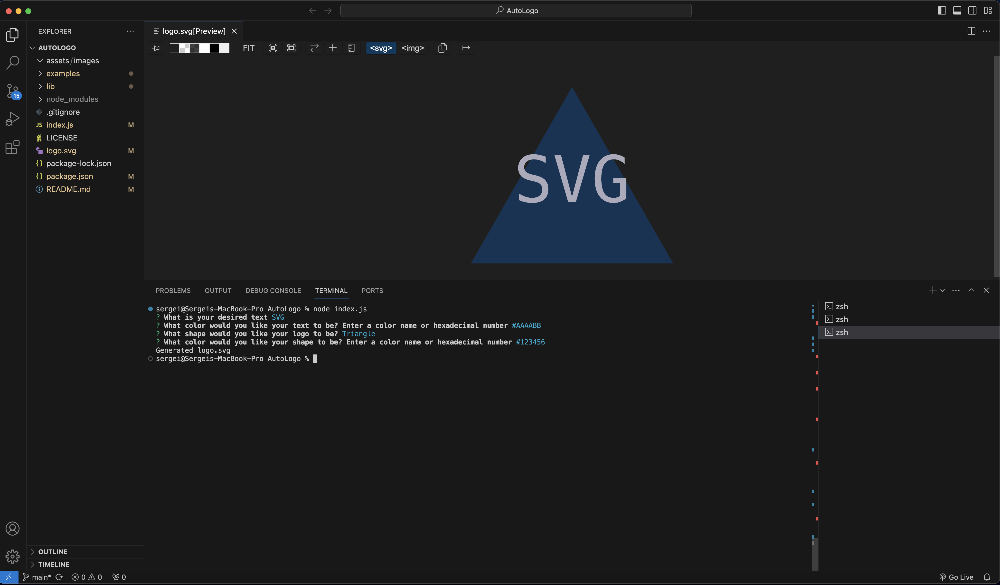

# AutoLogo

## Description

AutoLogo is a easy CLI driven tool for an easy and fast SVG logo generation. The tool uses user inputs for the text and text color, as well as the shape and shape color, to generate an SVG that matches the user input

## Table of Contents

- [Installation](#installation)
- [Usage](#usage)
- [Credits](#credits)
- [License](#license)
- [Testing](#testing)
- [Video](#video-link)

## Installation

Run `npm i` to install jest and inquirer that are required for user input and testing

## Usage

Once installation is complete, run `node index.js` to launch the application. 

Screenshot provides the command to start the application, all of the user inputs, and the preview of the generated SVG file

## Credits

Done by Serg Malyshka. Regex for the hexValidator function sourced through here: https://www.geeksforgeeks.org/how-to-validate-hexadecimal-color-code-using-regular-expression/

## License

Standard MIT license

## Testing

Run `npm run test` command after installation is complete to run all the testing

## Video Link

https://drive.google.com/file/d/1bkAXEusZutriLBQxJTDM4Vwnig3MVCFS/view

